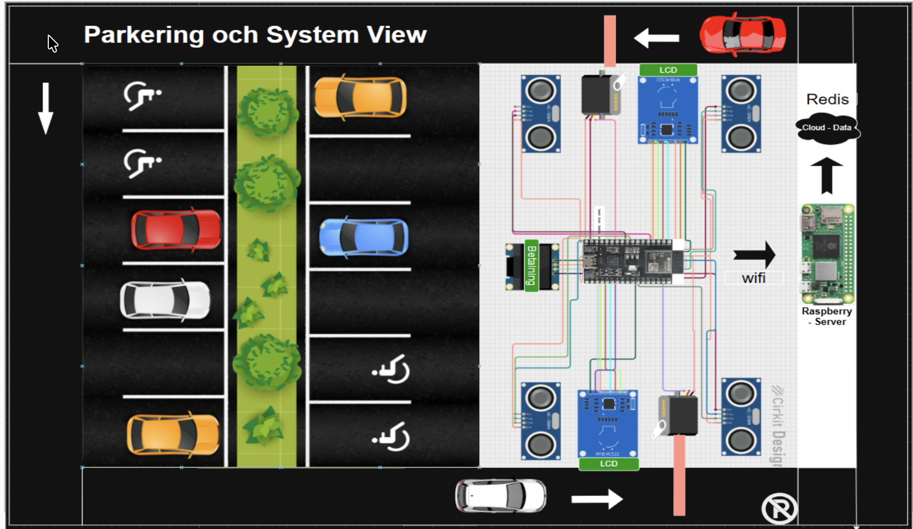
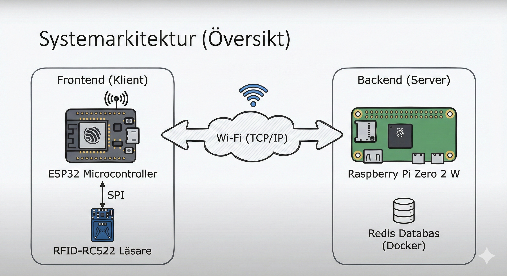
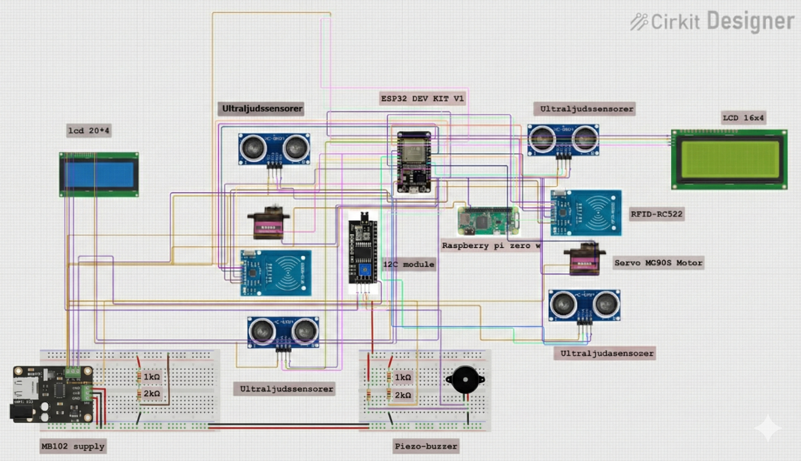

# Automatiserat IoT-Parkeringssystem med Edge Computing

> Ett driftsäkert parkeringssystem baserat på ESP32, RFID och Redis med offline-stöd.



## 📖 Projektöversikt

Målet med detta projekt är att utveckla ett automatiserat och driftsäkert parkeringssystem baserat på IoT-teknik. Systemet hanterar in- och utfart av fordon via RFID-identifiering och använder en lokal Redis-databas för snabb datahantering.

Fokus ligger på att skapa en robust **"Edge Computing"**-lösning där systemet fungerar sömlöst både online och offline genom smart datasynkronisering ("Store and Forward").

### Nyckelfunktioner

* **RFID-Autentisering:** Säker in- och utfart med RC522-läsare.
* **Fordonsdetektering:** Ultraljudssensorer säkerställer att bommar inte stängs på fordon.
* **Edge Database:** Lokal Redis-databas körs i Docker på en Raspberry Pi Zero 2 W.
* **Offline-stöd:** Data buffras lokalt på ESP32 (LittleFS) vid nätverksbortfall och synkroniseras automatiskt när anslutningen återupptas.
* **Visuell Feedback:** LCD-skärmar och servostyrda bommar.

---

## 🏗 Systemarkitektur

Systemet bygger på en klient-server-arkitektur där mikrokontrollern styr hårdvaran och servern hanterar datan.



### Hårdvara (Hardware)

* **Styrenhet (Klient):** ESP32 Dev Kit V1.
* **Server (Backend):** Raspberry Pi Zero 2 W.
* **Sensorer:** 2x RFID-RC522 (SPI), 4x HC-SR04 Ultraljudssensorer.
* **Aktuatorer:** 2x Servomotorer (SG90/MG996R) för bommar, Piezo-summer.
* **Display:** 2x LCD 1602 med I2C-moduler.
* **Ström:** MB102 Power Supply Module (för stabil drift av motorer).

### Mjukvara (Software)

* **Språk:** C++ (Arduino Framework via PlatformIO).
* **Databas:** Redis (körs i Docker).
* **Filhantering:** LittleFS (för lokal buffring på ESP32).
* **Kommunikation:** Wi-Fi (TCP/IP), SPI, I2C.

---

## 🔌 Kopplingsschema & Design

Systemet är strikt uppdelat i frontend (sensorer) och backend (databas) för modularitet.



### Tekniska Lösningar

* **Spänningsdelning:** Ultraljudssensorernas 5V-signaler skalas ner till 3.3V med resistorer (1kΩ/2kΩ) för att skydda ESP32.
* **Strömförsörjning:** Separat strömkälla för servomotorer för att undvika "brownouts" på mikrokontrollern.
* **I2C:** Används för skärmarna för att minimera antalet GPIO-pinnar.

---

## 🚀 Utmaningar och Lösningar

Under utvecklingen identifierades och löstes följande kritiska utmaningar:

| Utmaning | Lösning |
| :--- | :--- |
| **Logiknivåer:** ESP32 (3.3V) vs Sensorer (5V) | Implementering av spänningsdelare på Echo-pinnarna. |
| **Strömspikar:** Processorn startade om vid motoraktivitet | Separat MB102 strömförsörjning och kondensatorer. |
| **Dataförlust:** Nätverksavbrott | **Store and Forward:** Data sparas till `/queue.txt` (LittleFS) och skickas när nätverket är tillbaka. |

---

## 🛠 Installation & Setup

### 1. Server (Raspberry Pi)

Kör Redis i en Docker-container:

```bash
docker run -d --name redis-stack -p 6379:6379 -v redis-data:/data redis/redis-stack:latest
